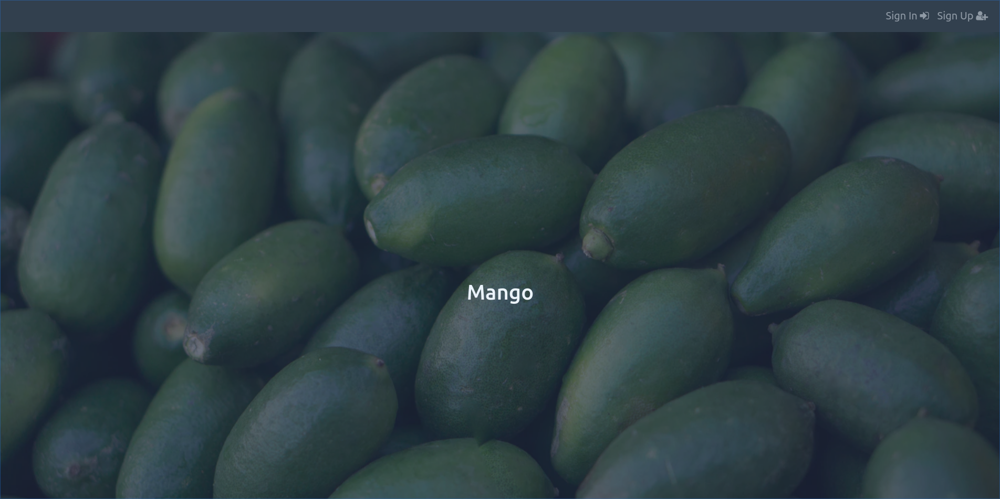
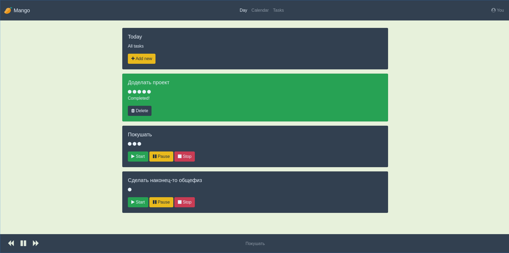

# Mango
*A new time-management tool*


[](https://coveralls.io/github/NikitaEvs/mangoWeb?branch=master)
---
[Demo](http://51.15.97.72:8000/)





## Summary
Most people listen to music, the mechanics of listening to it are clear to everyone.
Performing tasks is somewhat similar to listening to music, only a "playlist" is created
not based on favorite songs, but based on top tasks.

__Mango__ - a task scheduler that implements this concept.

Each task is a separate "track" that you can turn on, set
on pause and off, the current "track" is in the lower navbar.

You can add, view current tasks, view tasks by day, and
all existing tasks.

For each task, the start time and end time are recorded (excluding pause time),
so it is possible to estimate how much time you spend on routine tasks in order to plan time accurately and optimally in the future.

## Technical details
### I want to see/deploy
#### Very fast way :rocket:
See demo [here](http://51.15.97.72:8000/)
#### Local deployment :whale2:
[Here](https://hub.docker.com/r/nikitaevs/mango) you
can find last stable version. How to run?

Requirements:

- [Docker](https://docs.docker.com/get-docker/)
- [Docker compose](https://docs.docker.com/compose/install/)

First of all, clone the branch with configuration file ```docker-compose.yml```

```shell script
git clone --single-branch --branch docker https://github.com/NikitaEvs/mangoWeb.git
```

And run ```Docker```

```shell script
docker pull nikitaevs/mango
cd mangoWeb
docker-compose up -d
```

Success!

System will work on localhost:8000

### Techologies stack:
- Django
- PostgreSQL
- Bootstrap
- Docker
- GiHub Actions
- Coveralls

### Tests
[](https://coveralls.io/github/NikitaEvs/mangoWeb?branch=master)

List of tests:

- [Unit tests](tests/test_unit.py)
- [Views tests](tests/test_views.py)
- [Models tests](tests/test_model.py)
 
### CI/CD

- For ```push``` and ```pull_request``` configure
action, which runs all tests and
loads report on Coveralls

- For ```pull_request``` in ```master``` and ```dev```
configure a builidng in ```Docker``` container and downloading on ```docker-hub``` 
